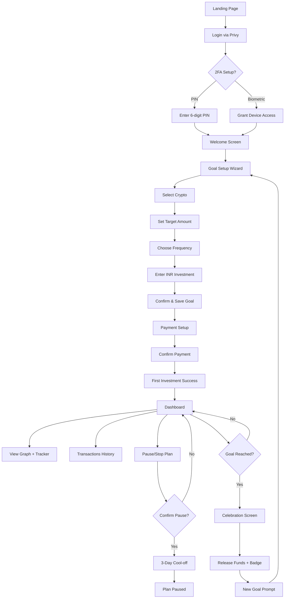

# 🧭 Wholecoiner Goal Tracker — Detailed User Flow Document

*(Companion to Spec Sheet v2, October 16 Edition)*

---

## 1. 🎯 Overview

This document maps the **complete end-to-end user journey** — from first-time entry to goal completion — covering all **screens, user actions, and backend triggers**.

It is designed for:

* Developers (for implementation sequence)
* Designers (for UI flow in Google Stitch)
* QA/Testers (for validation paths)

---

## 2. 🌐 Top-Level Flow Summary

**Primary Stages:**

1. **Entry Point** → Welcome & Login
2. **Security Setup** → 2FA
3. **Goal Creation Wizard**
4. **Investment Confirmation**
5. **Dashboard Experience (Existing Users)**
6. **Goal Progress & Tracking**
7. **Pause / Stop Flow (Behavioral Lock)**
8. **Goal Completion + Release**
9. **Settings / Logout**

---

## 3. 🧩 Detailed Step-by-Step Flow

---

### **Stage 1: Entry Point**

| Step | Screen                | User Action                 | System Behavior                                |
| ---- | --------------------- | --------------------------- | ---------------------------------------------- |
| 1.1  | **Landing Page**      | User visits app             | System checks Privy login status               |
| 1.2  | **Login Options**     | Click “Continue with Gmail” | Privy SDK initializes                          |
| 1.3  | **Social Auth Popup** | Select Gmail account        | Privy generates session & Solana wallet        |
| 1.4  | **Redirect**          | Redirect to 2FA setup       | Privy returns wallet address, stores in NeonDB |

---

### **Stage 2: Security Setup (2FA)**

| Step | Screen             | User Action                           | System Behavior                |
| ---- | ------------------ | ------------------------------------- | ------------------------------ |
| 2.1  | **2FA Setup**      | Choose method: “PIN” or “Biometric”   | System captures 2FA preference |
| 2.2  | **PIN Entry**      | If PIN chosen, enter 6-digit code     | Save encrypted 2FA token       |
| 2.3  | **Biometric Auth** | If biometric chosen, grant permission | Registers WebAuthn key         |
| 2.4  | **Verification**   | Re-enter PIN or re-authenticate       | Confirms setup success         |
| 2.5  | **Redirect**       | → New User Onboarding                 | User marked as verified in DB  |

---

### **Stage 3: Goal Creation Wizard (New Users)**

| Step | Screen                      | User Action                     | System Behavior                                   |
| ---- | --------------------------- | ------------------------------- | ------------------------------------------------- |
| 3.1  | **Welcome Screen**          | Tap “Start My Goal”             | Opens goal setup wizard                           |
| 3.2  | **Select Crypto**           | Choose BTC / ETH / SOL          | Sets tokenType param                              |
| 3.3  | **Set Target**              | Default = 1 coin                | User can adjust (optional)                        |
| 3.4  | **Investment Frequency**    | Select Daily / Weekly / Monthly | Saves preference                                  |
| 3.5  | **Investment Amount (INR)** | Input e.g., ₹5,000              | Validation: must ≥ ₹100                           |
| 3.6  | **Summary Screen**          | Review all parameters           | Display plan overview                             |
| 3.7  | **Confirm Plan**            | Tap “Confirm & Continue”        | Stores goal in NeonDB, triggers `/api/goals` POST |

---

### **Stage 4: Investment Confirmation & Auto-Mandate**

| Step | Screen              | User Action                         | System Behavior                             |
| ---- | ------------------- | ----------------------------------- | ------------------------------------------- |
| 4.1  | **Payment Setup**   | Choose method (UPI/Auto-Mandate)    | Redirects to RBI-compliant payment gateway  |
| 4.2  | **Confirm Payment** | Authorize transaction               | `/api/investments/execute` triggered        |
| 4.3  | **Success Screen**  | “Your first investment is complete” | Update goal progress = 1st installment done |
| 4.4  | **Redirect**        | → Dashboard                         | Goal marked active                          |

---

### **Stage 5: Dashboard (Existing User Homepage)**

| Step | Screen                  | User Action                                | System Behavior                        |
| ---- | ----------------------- | ------------------------------------------ | -------------------------------------- |
| 5.1  | **Dashboard Home**      | Auto-load after login                      | Fetch active goals `/api/goals` GET    |
| 5.2  | **Progress Card**       | View circular tracker (percentage to goal) | Compute via `/api/progress/:goalId`    |
| 5.3  | **Cumulative Graph**    | Visualize total INR invested vs value      | Display from NeonDB aggregates         |
| 5.4  | **Quick Actions**       | “Pause”, “Add Funds”, “Withdraw” buttons   | Conditional access based on lock logic |
| 5.5  | **Recent Transactions** | Scroll list of previous buys               | `/api/history` GET                     |

---

### **Stage 6: Notifications & Reinforcement**

| Event                  | Trigger                    | Notification Type                          |
| ---------------------- | -------------------------- | ------------------------------------------ |
| Investment executed    | API `/api/investments`     | “₹5000 invested successfully”              |
| 25%, 50%, 75% progress | `/api/progress` milestones | “You’re halfway to your Wholecoin!”        |
| Goal completed         | 100% goal                  | Celebration modal + email                  |
| Pause attempt          | `/api/goals/:id/pause`     | Warning: “Cool-off 3 days before stopping” |

---

### **Stage 7: Pause / Stop (Behavioral Lock Flow)**

| Step | Screen                    | User Action                      | System Behavior                  |
| ---- | ------------------------- | -------------------------------- | -------------------------------- |
| 7.1  | **Pause Modal**           | Click “Pause Investment”         | Show motivation message          |
| 7.2  | **Cool-off Confirmation** | “Are you sure you want to stop?” | Requires user confirmation twice |
| 7.3  | **Cooldown Timer**        | Display 3-day waiting UI         | Timer stored in backend          |
| 7.4  | **Resume Option**         | Can cancel pause anytime         | Reactivate immediately           |
| 7.5  | **Stop Confirmed**        | After cool-off expires           | Status = paused in NeonDB        |

---

### **Stage 8: Goal Completion**

| Step | Screen                      | User Action                                      | System Behavior                    |
| ---- | --------------------------- | ------------------------------------------------ | ---------------------------------- |
| 8.1  | **Completion Trigger**      | Goal reached (progress=100%)                     | Backend auto-releases funds        |
| 8.2  | **Celebration Screen**      | “You’re now a Wholecoiner!” + confetti animation | Display NFT-style badge (optional) |
| 8.3  | **Post-Completion Options** | “Start New Goal” / “Share Achievement”           | Offer next goal or social share    |
| 8.4  | **Funds Released**          | Auto-transfer to wallet                          | `/api/releaseFunds` executed       |
| 8.5  | **Update Dashboard**        | Move goal to Completed section                   | Historical goal data stored        |

---

### **Stage 9: Settings / Logout**

| Step | Screen                   | User Action           | System Behavior                   |
| ---- | ------------------------ | --------------------- | --------------------------------- |
| 9.1  | **Settings**             | Access from navbar    | `/api/user` GET                   |
| 9.2  | **Manage 2FA**           | Reset PIN / Biometric | `/api/auth/2fa/update` PATCH      |
| 9.3  | **Notification Toggles** | Enable/disable alerts | `/api/notifications` PUT          |
| 9.4  | **Logout**               | Tap “Sign Out”        | `/api/auth/logout` clears session |

---

## 4. 🧾 Flowchart Diagram (Textual Layout)

### **Mermaid-Compatible Flow (for Google Stitch or Notion embedding)**

---

## 5. 🧮 Backend API Triggers by Stage

| Stage         | API Calls                                     | Purpose            |
| ------------- | --------------------------------------------- | ------------------ |
| Login         | `/api/auth/login`                             | Privy login        |
| 2FA           | `/api/auth/2fa/verify`                        | Setup & verify 2FA |
| Goal Creation | `/api/goals` (POST)                           | Create new goal    |
| Payment       | `/api/investments/execute`                    | Execute investment |
| Dashboard     | `/api/goals`, `/api/history`, `/api/progress` | Display status     |
| Pause         | `/api/goals/:id/pause`                        | Start cool-off     |
| Completion    | `/api/releaseFunds`                           | Disburse funds     |
| Notifications | `/api/notifications`                          | Send milestones    |

---

## 6. 🧩 Role-Specific Highlights

| Role          | Focus                                                       |
| ------------- | ----------------------------------------------------------- |
| **Developer** | API sequence + state management                             |
| **Designer**  | Screen layout, button hierarchy, navigation flow            |
| **Tester**    | Validate edge cases (pause, withdrawal, 2FA error)          |
| **PM**        | Monitor milestone completion and behavioral lock compliance |

---

## 7. 📊 Integration Notes (Google Stitch)

To generate UI via Google Stitch:

* Input: Spec Sheet v2 + this User Flow document.
* Required sections:

  * Screen name
  * User actions
  * System behavior
  * API trigger (optional metadata)
* Output: HTML/CSS + interaction prototypes per screen.

---

## 8. 🧱 Deliverables from this Flow

| Output                  | Format                      | Destination                 |
| ----------------------- | --------------------------- | --------------------------- |
| **Flowchart**           | Mermaid / PNG               | Included in Notion / Stitch |
| **Clickable Prototype** | Generated via Google Stitch | UI Review                   |
| **QA Checklist**        | CSV / Sheet                 | Testing phase               |
| **Flow Doc (This)**     | Google Docs / Notion        | Reference file              |

---

## 9. ✅ Summary

The **Wholecoiner User Flow v2** now includes:

* Full **end-to-end navigation** (entry → exit)
* **Distinct new vs. existing user journeys**
* **2FA setup**, **behavioral lock**, and **dashboard graph** integrations
* **All button and system behaviors** clearly mapped
* **Flowchart** ready for Google Stitch automation

